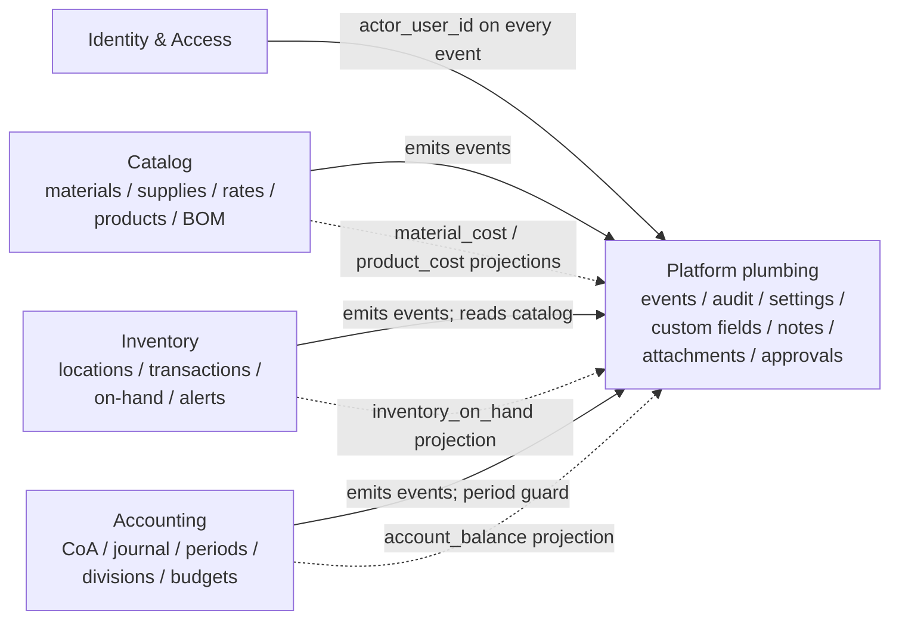

# Architecture (current state)

What's actually landed in `main` as of this writing, organized so a new
contributor can map a feature request to the right module without spelunking.
For the original design intent — the "what we set out to build" — see
[`print-sales-v2/04_architecture.md`](../print-sales-v2/04_architecture.md).
That spec is the **design history**; this file is the moving target.

Related docs:
[`event_catalog.md`](event_catalog.md) for every event type in the system,
[`migrations.md`](migrations.md) for the Alembic timeline,
[`development.md`](development.md) for how to run the thing locally,
[`../agents.md`](../agents.md) for the non-negotiables.

## System shape

**Backend.** A single FastAPI app under `backend/app/`, SQLAlchemy 2 async
against Postgres 16. Routers stay thin; business logic lives in
`backend/app/services/`. Alembic migrations live in `backend/alembic/versions/`
and run on every schema-changing deploy.

**Database.** Postgres 16, single instance. No Redis, no message broker — the
event log is the queue, and Postgres-native primitives (`SELECT ... FOR
UPDATE`, partial unique indexes, GiST exclusion, btree_gist, JSONB, ENUMs,
immutability triggers) carry the load. Unit tests run on SQLite where the
features overlap and skip integration-only assertions where they don't.

**Frontend.** A React 19 + TypeScript SPA under `frontend/`, Vite-built,
Tailwind 4 + Radix wrappers, TanStack Query for server state, Zustand for the
auth store. Types are generated from the backend's OpenAPI export — never
hand-written. See [`openapi-codegen.md`](openapi-codegen.md).

**Deployment.** A single VM (`web01.internal`) running Docker Compose:
`db`, `backend`, `frontend`. The canonical deploy path is the
[`web01-deploy` n8n workflow](../ops/n8n/web01-deploy.json) — pull → migrate →
rebuild → verify. Manual SSH is the fallback, documented in
[`web01_runbook.md`](web01_runbook.md).

## Bounded contexts

The repo is organized by bounded context, not by technical layer. Each
context owns its service modules, its read-model tables (populated by
projections — see below), and a slice of the wire surface.

| Context | Service modules (`backend/app/services/`) | Read-model tables | Wire prefix |
|---|---|---|---|
| **Identity & Access** | `auth.py`, `users.py` | `user`, `refresh_token` | `/api/v1/auth/*`, `/api/v1/users/*` |
| **Platform plumbing** | `event_store.py`, `audit.py`, `reference_number.py`, `settings/`, `custom_fields.py`, `form_templates.py`, `notes.py`, `attachments/`, `approvals.py` | `event`, `audit_log`, `projection_cursor`, `reference_sequence`, `setting`, `custom_field`, `form_template`, `form_template_field`, `note`, `attachment`, `approval_request` | `/api/v1/audit/*`, `/api/v1/settings/*`, `/api/v1/custom-fields/*`, `/api/v1/form-templates/*`, `/api/v1/notes/*`, `/api/v1/attachments/*`, `/api/v1/approvals/*` |
| **Catalog** | `materials.py`, `supplies.py`, `rates.py`, `products.py`, `bom.py`, `material_receipts.py` | `material`, `material_receipt`, `supply`, `rate`, `product`, `product_bom_item` | `/api/v1/materials/*`, `/api/v1/supplies/*`, `/api/v1/rates/*`, `/api/v1/products/*` (BOM nested under products) |
| **Inventory** | `inventory_locations.py`, `inventory_transactions.py`, `inventory_alerts.py` | `inventory_location`, `inventory_transaction`, `inventory_on_hand` | `/api/v1/inventory/locations/*`, `/api/v1/inventory/transactions/*`, `/api/v1/inventory/on-hand/*`, `/api/v1/inventory/alerts/*` |
| **Accounting** | `accounts.py`, `journal_entries.py`, `accounting_periods.py`, `divisions.py`, `budgets.py` | `account`, `journal_entry`, `journal_line`, `account_balance`, `accounting_period`, `division`, `budget` | `/api/v1/accounting/accounts/*`, `/api/v1/accounting/journal-entries/*`, `/api/v1/accounting/periods/*`, `/api/v1/accounting/divisions/*`, `/api/v1/accounting/budgets/*` |

RBAC roles are fixed: `owner`, `bookkeeper`, `production`, `sales`, `viewer`
— deny by default. The enum lives in migration `0002_auth.py` and the role
constant in `app/models/auth.py`.

## Event-sourced foundation

Every domain mutation goes through `EventStoreService.append`
(`app/services/event_store.py`), which writes one row to the append-only
`event` table and synchronously dispatches the event through every
registered projection handler — all inside the same DB transaction. A
handler failure rolls back the event row itself.

**Invariants in force:**

- **Append-only with hash chain.** The `event` table has a `BEFORE UPDATE
  OR DELETE` trigger on Postgres that rejects any mutation
  (`0003_event_log.py`). Each row carries a `payload_hash` and `prev_hash`
  forming a chain rooted at the first event.
- **Synchronous projection in the same TX.** Live projection is in-process
  and in-transaction; the `projection_cursor` table is touched only during
  out-of-band replay (`app/projections/replay.py`). See
  `app/projections/registry.py` for the handler contract.
- **Replay-safe handlers.** Every handler must be idempotent. The wildcard
  audit handler pre-checks `event_position`; aggregating handlers use
  upsert / replace semantics keyed on the natural identity of the
  read-model row.
- **Schema-version upcasting.** Event payloads are typed Pydantic models in
  `app/events/types/` with `extra="forbid"`. A stray key trips registration
  immediately.

**Active projection handlers** (`app/projections/`):

| Handler | Subscribes to | Read-model tables |
|---|---|---|
| `audit_log_projection` | `*` (wildcard) | `audit_log` |
| `material_cost` | `inventory.MaterialReceived` | `material` (weighted-avg cost cache) |
| `product_cost` | `catalog.BomComponent*`, `catalog.MaterialUpdated`, `catalog.SupplyUpdated`, `catalog.ProductCostChanged`, `inventory.MaterialReceived` | `product.unit_cost_cached`; emits `catalog.ProductCostChanged` to propagate up the BOM tree |
| `inventory_on_hand` | `inventory.TransactionRecorded` | `inventory_on_hand` |
| `account_balance` | `accounting.JournalEntryPosted` (+ a no-op for `JournalEntryReversed`, which is materialized as a fresh posting) | `account_balance` |
| `settings_cache_invalidator` | `settings.SettingChanged` | (in-process cache; no table) |
| `test_event_projection` | `test.TestEvent` | `projection_test_event` (smoke-test only) |

See [`event_catalog.md`](event_catalog.md) for the full event-by-event view
of emitters and subscribers.

## Cross-cutting platform contracts

- **Auth.** Email + password, bcrypt hashes. Access tokens are JWTs;
  refresh tokens rotate on every use, with family revocation on reuse.
  Failed/inactive/rate-limited login attempts are emitted as `auth.*`
  events with an `ip` field for the audit projection. Frontend axios
  client carries the refresh-rotation interceptor.
- **RBAC.** Five fixed roles (`owner`, `bookkeeper`, `production`,
  `sales`, `viewer`), deny by default. The role is part of the JWT and
  enforced by FastAPI dependencies.
- **Reference numbering.** `ReferenceNumberService` (`reference_number.py`)
  allocates `{PREFIX}-{YYYY}-{NNNN}` via a row-locked
  `INSERT ... ON CONFLICT (prefix, year) DO UPDATE SET last_value =
  last_value + 1 RETURNING last_value` on the `reference_sequence` table.
  Never `COUNT(*)`. Property-tested.
- **Settings.** Typed key/value registry (`services/settings/`) with
  schema-on-read — the registry knows each key's declared type
  (decimal / int / string / bool / json) and the service coerces and
  validates on read and write. Owner-only writes emit
  `settings.SettingChanged`; the `settings_cache_invalidator` projection
  busts the in-process cache.
- **Audit log.** A wildcard projection over the event log. The denormalized
  `payload_excerpt` column is gated by an **explicit whitelist** per
  event type — no excerpt unless registered. Sensitive field names
  (`password`, `token`, `refresh_token`, …) are belt-and-suspenders
  forbidden at registration time. See `app/projections/audit/excerpts.py`
  and the audit section of [`event_catalog.md`](event_catalog.md).
- **Approvals.** Generic queue with `pending → approved | rejected |
  cancelled`. The service enforces self-approval guards (you cannot
  approve your own request) and writes `platform.Approval*` events. The
  full proposed payload lives on the `approval_request` row, never in
  the event payload — only a short `payload_summary` does — so the audit
  log never carries sensitive request contents.
- **Custom fields & form templates.** Per-entity-type custom fields
  with form-template assemblies; values are stored in a `custom_fields`
  JSONB column on each catalog entity.
- **Notes & attachments.** Polymorphic (`entity_kind`, `entity_id`) refs
  to any catalog entity. Note bodies are truncated to a 100-char preview
  in the event payload; attachment payloads carry filename / mime / size
  but never the storage path or bytes.

## Frontend stack

- Vite + React 19 + TypeScript strict.
- Tailwind 4 + Radix UI primitives wrapped in `frontend/src/components/ui/`.
- TanStack Query 5 for server state; Zustand 5 for the auth store.
- `react-hook-form` + `zod` for form validation.
- Axios client with the refresh-rotation interceptor in
  `frontend/src/api/client.ts`.
- **OpenAPI codegen pipeline.** `pnpm run codegen:export` dumps the
  backend spec to `frontend/src/api/openapi.json`; `pnpm run codegen`
  regenerates `frontend/src/api/types.ts`. CI runs `pnpm run codegen:check`
  and fails the build on drift. Never hand-edit the generated file. See
  [`openapi-codegen.md`](openapi-codegen.md).

## Architectural non-negotiables in force

From [`../agents.md`](../agents.md) and the spec set; restated here so a
new contributor doesn't have to learn them by breaking them.

- **Event-sourced accounting.** Domain events are the source of truth;
  balances and projections are derived. Every accounting mutation goes
  through the event store inside the same TX as its side effects.
- **Race-safe reference numbers** via the row-locked allocator. Never
  `COUNT(*)`.
- **OpenAPI codegen drift is a CI failure.** Backend schema changes ship
  with the regenerated `openapi.json` + `types.ts`.
- **Fixed RBAC roles.** No tenant-defined roles; no per-resource ACLs.
- **Postgres-native concerns only.** No Redis, no RabbitMQ. The event log
  is the queue and Arq (when it lands in a later phase) will sit on top
  of `pg-boss` / `pgmq`.
- **Lazy-loaded printer monitor (Phase 5).** Moonraker WS must not block
  app boot. Real v1 incident.
- **Single-tenant, USD-only, no MFA/SSO, no staging.** Pushing past these
  requires a decision-record update.

## Deployment

- Target: `web01.internal`, single VM, Docker Compose stack
  (`3d-print-sales-db`, `3d-print-sales-backend`, `3d-print-sales-frontend`
  for v1; v2 containers land under the new compose at cutover).
- Canonical entry: the `web01-deploy` n8n workflow
  ([`ops/n8n/web01-deploy.json`](../ops/n8n/web01-deploy.json)) — pull,
  migrate, rebuild, verify, per-step observability. Operator runbook:
  [`deployment_n8n_workflow.md`](deployment_n8n_workflow.md).
- Fallback: manual SSH path documented in
  [`web01_runbook.md`](web01_runbook.md).
- **Migrations run on every schema-changing deploy.** Backend startup
  queries newly-added tables; skipping migrations crashes the container
  (real v1 incident, 2026-05-09). Use `SKIP_MIGRATIONS=1` only for
  code-only emergency redeploys.

## Shipped beyond the early sections

The bounded-contexts table at the top of this file documents Phases 0–4.
Everything below has also shipped to `main` — see [`CHANGELOG.md`](../CHANGELOG.md)
for the per-phase summary and PR links.

| Phase | Context | Wire prefix | Notes |
| --- | --- | --- | --- |
| **5** | Production | `/api/v1/printers`, `/api/v1/cameras`, `/api/v1/jobs`, `/api/v1/production-orders`, `/api/v1/pos` | Lazy-loaded Moonraker integration |
| **6** | Sales | `/api/v1/sales-channels`, `/api/v1/sales`, `/api/v1/refunds`, `/api/v1/shipments` | COGS FIFO; channel fees |
| **7** | AR | `/api/v1/quotes`, `/api/v1/invoices`, `/api/v1/payments`, `/api/v1/customers`, `/api/v1/recurring-invoices`, `/api/v1/late-fee-policies` | Statement email; AR aging |
| **8** | AP + Banking | `/api/v1/vendors`, `/api/v1/bills`, `/api/v1/bill-payments`, `/api/v1/expense-claims`, `/api/v1/billable-expenses`, `/api/v1/recurring-bills`, `/api/v1/banking/*` | Bank imports, match rules, reconciliation, inter-account transfers |
| **9** | Specialized accounting | `/api/v1/fixed-assets`, `/api/v1/depreciation-runs`, `/api/v1/tax-profiles`, `/api/v1/tax-remittances`, `/api/v1/withholding-profiles`, `/api/v1/settlements` | Depreciation worker; compound + reverse-charge tax; marketplace settlement matcher + payout JE |
| **10** | Reporting + Dashboard | `/api/v1/reports/*`, `/api/v1/dashboard/*` | Income statement, balance sheet, cash flow, trial balance, sales-by-period, inventory valuation, AR/AP aging, tax liability, withholding 1099, KPI tiles, AI insights worker |
| **11** | Notifications + admin | `/api/v1/webhooks/*`, `/api/v1/webhooks/inbound/*`, `/api/v1/batch/{preview,commit}`, `/api/v1/control-center` | HMAC-signed outbound webhooks + DLQ; inbound carrier + marketplace intake; batch preview/commit; admin aggregate |

## Still ahead

Phase 12 (hardening + v1 cutover) is in flight — load testing, PITR drill,
WCAG pass, v1 data migration, doc pass. See
[`print-sales-v2/IMPLEMENTATION_PLAN.md`](../print-sales-v2/IMPLEMENTATION_PLAN.md)
§5 for the original scope and the [`phase-12`](https://github.com/bbengt1/voxel-ledger/labels/phase-12)
label for tracked work.
