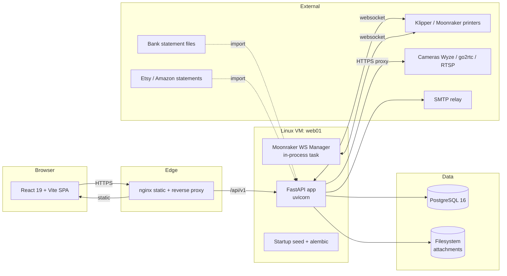
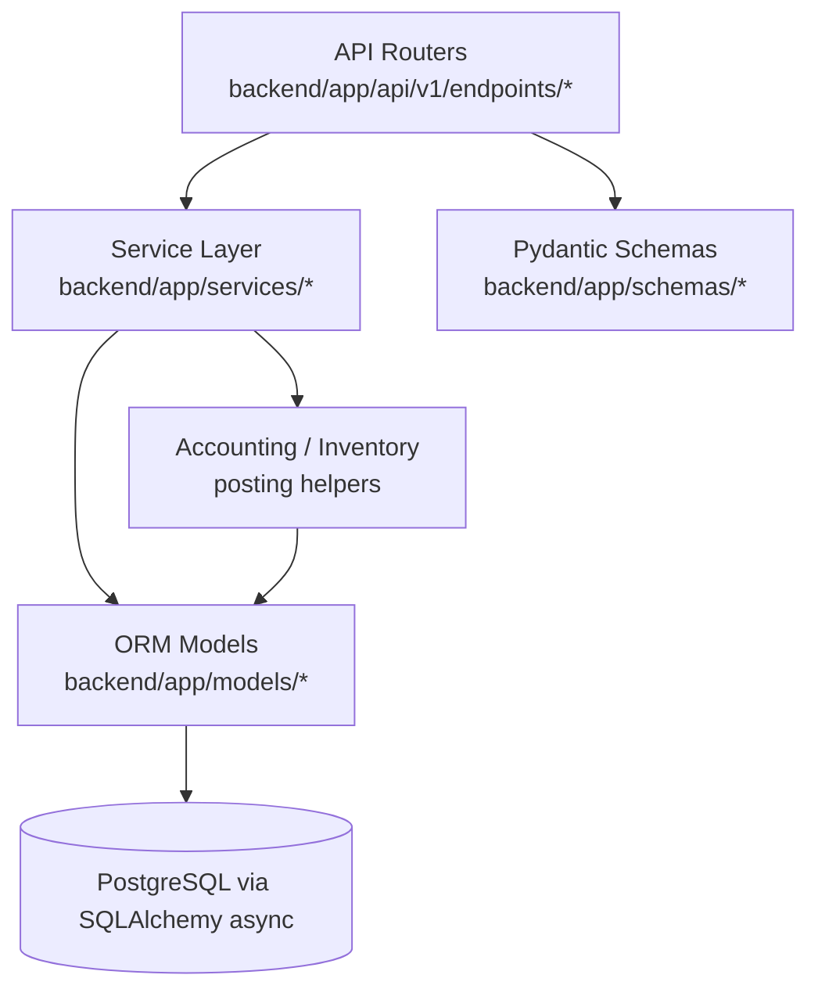
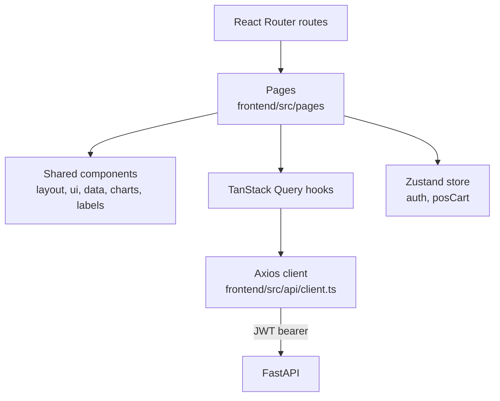
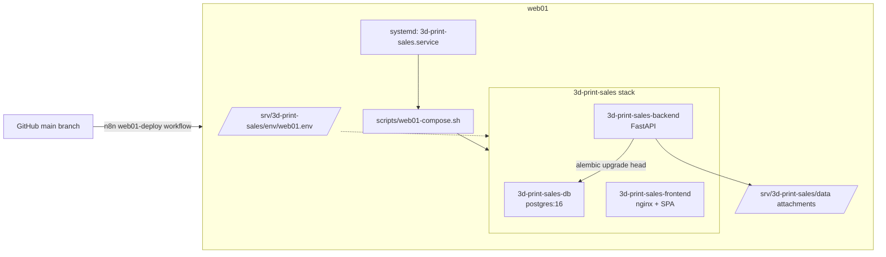

# 4. High-Level Architecture

## 4.1 Current Architecture (snapshot)



## 4.2 Layered View of the Backend



- **Routers:** validate request, call services, format response.
- **Services:** all business logic. Inventory, accounting, COGS, pricing, settlements, printers, reports.
- **Models:** SQLAlchemy 2.x async. ~65 models.
- **Schemas:** Pydantic request/response shapes.

## 4.3 Frontend Architecture



- **Pages** = route-level UI; one per major resource.
- **Shared components** = `ui/` primitives (Radix), `layout/`, `data/` tables, `charts/` (recharts), `labels/`, `cameras/`, `printers/`.
- **Auth state** persisted via Zustand; axios interceptor handles 401 → redirect to login preserving original URL.
- **Server state** via TanStack Query; **client state** via Zustand.
- **Forms** via react-hook-form + zod resolvers.

## 4.4 Communication Patterns

| Pattern | Where |
|---|---|
| Synchronous HTTP/JSON | Browser ↔ backend (all CRUD) |
| Long-lived websocket | Backend ↔ Moonraker printers |
| HTTP proxy | Backend ↔ camera snapshot endpoints |
| File ingest | Bank statements, marketplace settlements, attachments |
| SMTP | Outbound email (quotes, invoices, statements) |
| Scheduled / background | Recurring invoices, depreciation, AI insights, late fees (currently inlined; should move to a worker queue) |

## 4.5 Bounded Contexts (recommended for v2)

The current code mixes contexts heavily. A clean v2 should formalize:

1. **Identity & Access** — users, sessions, roles, audit.
2. **Catalog** — products, materials, supplies, rates, BOMs, custom fields, labels.
3. **Inventory** — locations, transactions, transfers, starting balances, scrap.
4. **Production** — jobs, plates, printers, cameras, production orders, history.
5. **Sales** — sales, sale_items, channels, POS, shipping labels, refunds, settlements.
6. **AR** — quotes, invoices, payments, customer credits, recurring invoices, late fees.
7. **AP** — vendors, bills, bill payments, expense categories, expense claims, recurring expenses.
8. **Banking** — bank/cash accounts, statement imports, reconciliations, transfers, match rules.
9. **Accounting Core** — chart of accounts, journals, periods, divisions, recurring JEs, fixed/intangible assets, tax, withholding, approvals.
10. **Reporting** — read models for dashboards, P&L, BS, CF, TB, AR/AP aging, sales tax.
11. **Notifications** — email delivery, in-app notices.
12. **Platform** — settings, attachments, form templates, batch ops, audit log.

Each context owns its tables and exposes a service API. Cross-context calls go through services, not direct DB joins, to keep extraction possible.

## 4.6 Technology Stack (current; v2 may revisit)

**Backend**
- Python 3.13, FastAPI 0.115, Uvicorn
- SQLAlchemy 2 async, asyncpg, Alembic
- Pydantic 2 (+ pydantic-settings)
- python-jose, bcrypt
- python-barcode, qrcode[pil], Pillow
- httpx, aiosqlite (tests), python-multipart
- pytest, pytest-asyncio

**Frontend**
- React 19, TypeScript, Vite 8
- Tailwind 4, Radix UI primitives, lucide-react, cmdk
- TanStack Query 5, Zustand 5
- react-hook-form 7, zod 4
- axios, sonner (toasts), recharts
- vitest, @testing-library/react

**Infra**
- Docker Compose (dev + prod)
- nginx (frontend container + reverse proxy)
- PostgreSQL 16
- systemd unit on `web01`
- n8n workflow for deploy orchestration

**v2 stack suggestions to evaluate** (not prescriptive):
- Replace ad-hoc background work with a proper job queue (RQ, Arq, Temporal, or PG-native via pg-boss/pgmq).
- Add OpenTelemetry + a tracing backend.
- Generate frontend TS types from OpenAPI to eliminate the four-place type drift problem.
- Consider tRPC or GraphQL only if it provably reduces drift; OpenAPI codegen is usually sufficient.

## 4.7 Deployment Topology



- Canonical deploy: n8n workflow at `ops/n8n/web01-deploy.json` orchestrates pull → migrate → rebuild → verify.
- Fallback: SSH + `scripts/web01-compose.sh up -d --build` or `/srv/3d-print-sales/deploy.sh`.
- **Migrations must run** on every schema-changing deploy or the backend crashes at startup.

## 4.8 Integration Points (v2)

| External | Direction | Protocol | Purpose |
|---|---|---|---|
| Moonraker / Klipper | Bidirectional, persistent | WebSocket | Printer state, history |
| Cameras (Wyze/go2rtc/RTSP) | Outbound HTTP | HTTP | Snapshot proxy |
| SMTP | Outbound | SMTP | Email delivery |
| Bank | Inbound (file) | CSV/OFX | Statement import |
| Etsy / Amazon | Inbound (file or webhook) | CSV / HTTPS POST | Settlement import; inbound webhook supersedes files where API allows |
| **Shipping carrier** (EasyPost or ShipStation) | Outbound | HTTPS | Buy labels, fetch tracking, void labels |
| **Outbound webhooks** (user-configured URLs) | Outbound | HTTPS POST + HMAC signature | Fan out domain events (sale.created, invoice.paid, printer.failed, settlement.imported, refund.issued) |
| **Inbound webhooks** (per integration) | Inbound | HTTPS POST + signature verify | Carrier tracking updates, marketplace order/refund events |
| Payment processors | Outbound | HTTPS | Out of v2 scope |

## 4.9 Cross-Cutting Components (v2)

- **Event log + projection engine** — append-only domain events are the source of truth for accounting and most ledgered state. Projections (journal lines, account balances, AR/AP, inventory, report cubes) are rebuilt from the log. See [12 §12.6.1](12_glossary_assumptions_decisions.md#1261-event-sourced-accounting--architecture-notes).
- **Reference number allocator** — race-safe DB sequence; runs before event append so the allocated number is part of the event payload.
- **Audit log** — projection of the event log; no separate write path.
- **Approvals** — gating for refunds, adjustments, and period close above threshold.
- **Webhook dispatcher** — outbound deliveries ride the event log (subscribe → deliver → retry → dead-letter); HMAC-signed; per-target delivery state.
- **Custom fields / form templates** — extensibility surface.
- **Attachment service** — local disk under `/srv/3d-print-sales/data/attachments` (no object storage in v2).
- **Rate limiter** — per-IP middleware (current: 120/min).
- **Generated API client** — `frontend/src/api/generated/` produced from the FastAPI OpenAPI spec at build time; no hand-typed resource shapes.

## 4.10 Frontend ↔ Backend Type Contract

The frontend consumes the backend's OpenAPI spec as the contract:

```mermaid
flowchart LR
  BE[FastAPI app] -->|emits| OAS[/api/v1/openapi.json/]
  OAS -->|openapi-typescript codegen<br/>(prebuild step)| GEN[frontend/src/api/generated/*]
  GEN --> Q[TanStack Query hooks]
  Q --> PAG[Pages / components]
```

- A `pretest`/`prebuild` step regenerates the client. CI fails if the regenerated output differs from what's committed.
- Resource bodies, params, and response shapes are imported from `generated/`. No manual mirrors.
- Hand-written code is limited to thin React-Query hook wrappers and UI mapping (e.g., presentation-only types).
