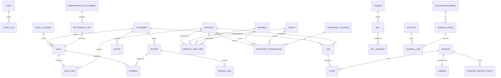

# 5. Data Model Documentation

The current system has ~65 SQLAlchemy models in `backend/app/models/`. This document captures the entities grouped by bounded context, the key fields, and the major relationships. A v2 implementation should treat this as a starting set — many tables can be simplified or merged.

## 5.0 v2 Storage Model Note

v2 is **event-sourced for accounting-relevant state** (see [12 §12.6.1](12_glossary_assumptions_decisions.md#1261-event-sourced-accounting--architecture-notes)). The tables described below are the **projection schema** — read models derived from the event log, not the write side. Writes go to the event log first; projections are updated synchronously in the same transaction (single Postgres) so reads stay consistent.

The event log table:

| Field | Type | Notes |
|---|---|---|
| `id` | uuid PK | |
| `position` | bigint, auto-increment, unique | Strict order of events |
| `type` | text | e.g. `SaleConfirmed`, `RefundIssued`, `MaterialReceived`, `PeriodClosed` |
| `aggregate_type` | text | e.g. `sale`, `invoice`, `material`, `period` |
| `aggregate_id` | text | The id of the entity the event mutates |
| `payload` | jsonb | Event-specific data |
| `schema_version` | smallint | For upcasters |
| `occurred_at` | timestamptz | Business time |
| `recorded_at` | timestamptz | Wall-clock at append |
| `actor_user_id` | uuid? | Acting user (null = system) |
| `correlation_id` | uuid | Groups events from one user action |
| `causation_id` | uuid? | The event that caused this one |
| `prev_event_hash` | bytea | Tamper-evidence hash chain |

Snapshots (per aggregate, every N events) live in `event_snapshot(aggregate_type, aggregate_id, position, state jsonb)`.

## 5.1 Entity-Relationship Overview



## 5.2 Entities by Context

### Identity & Access

| Entity | Purpose | Key fields |
|---|---|---|
| `user` | Auth principal | `id`, `email` (unique), `password_hash`, `is_active`, `created_at` |
| `user_role` | RBAC binding | `user_id`, `role` (`owner` \| `bookkeeper` \| `production` \| `sales` \| `viewer`) |
| `refresh_token` | Rotating refresh token | `jti` (PK), `user_id`, `family_id`, `issued_at`, `expires_at`, `revoked_at?`, `replaced_by_jti?` |
| `audit_log` | Projection of event log; read-only | (derived) |
| `approval_request` | Gated action | `id`, `kind`, `payload`, `requested_by`, `status`, `approved_by`, `decided_at` |

> The `is_admin` boolean from v1 is removed. Permissions derive from `user_role`. See [09 §9.3](09_security_compliance.md#93-authorization--rbac).

### Catalog

| Entity | Purpose | Key fields |
|---|---|---|
| `setting` | Global config | `key` (PK), `value` (jsonable string), `updated_at` |
| `material` | Filament | `id`, `name`, `type`, `color`, `cost_per_g`, `on_hand_g`, `vendor_id?`, `is_active` |
| `material_receipt` | Stock in | `id`, `material_id`, `qty_g`, `unit_cost`, `received_at`, `vendor_id?` |
| `supply` | Non-filament consumables | `id`, `name`, `category`, `unit`, `cost_per_unit`, `on_hand`, `reorder_point`, `vendor_id?`, `is_active` |
| `rate` | Labor / machine / overhead | `id`, `kind` (labor/machine), `value`, `unit`, `is_active` |
| `product` | SKU | `id`, `sku` (auto), `upc?`, `name`, `description`, `default_price`, `default_cost`, `reorder_point`, `on_hand`, `is_archived`, `image_path?` |
| `product_bom_item` | BOM row | `id`, `product_id`, `component_kind` (material/supply/product), `component_id`, `quantity`, `unit` |
| ~~`kit_component`~~ | **Dropped in v2.** Kits are products whose BOM contains `product` components in `product_bom_item`. Cycle detection required. | |
| `custom_field` | Extensibility | `id`, `entity_type`, `name`, `value_type`, `options?` |
| `form_template` | Form configs | `id`, `name`, `entity_type`, `definition` (json) |
| `attachment` | Files | `id`, `entity_type`, `entity_id`, `path`, `mime`, `size`, `uploaded_by`, `created_at` |
| `note` | Free text | `id`, `entity_type`, `entity_id`, `body`, `created_by`, `created_at` |
| `barcode` data | Implicit on product (`upc`, generated SKU label) | |

### Inventory

| Entity | Purpose | Key fields |
|---|---|---|
| `inventory_location` | Bin / room / shelf | `id`, `name`, `kind`, `is_active` |
| `inventory_transaction` | Movement ledger | `id`, `kind` (production/sale/adjustment/return/waste/receipt/transfer), `entity_kind` (product/material/supply), `entity_id`, `qty_delta`, `unit_cost`, `location_id`, `ref_kind`, `ref_id`, `created_at`, `created_by` |
| `product_location_stock` (derived/cached) | Per-location qty | `product_id`, `location_id`, `qty` |

### Production

| Entity | Purpose | Key fields |
|---|---|---|
| `printer` | Machine | `id`, `name`, `model`, `watts`, `moonraker_url`, `is_active`, `notes` |
| `printer_history_event` | Timeline | `id`, `printer_id`, `event`, `payload`, `at` |
| `camera` | Stream | `id`, `name`, `stream_url`, `type`, `is_active`, `assigned_printer_id?` (unique) |
| `job` | Print run | `id`, `customer_id?`, `product_id?`, `material_id?`, `plates`, `grams_per_plate`, `print_hours`, `labor_minutes`, `watts?`, `packaging_cost`, `shipping_cost`, `margin_override?`, `status`, `notes`, computed cost fields, `created_at`, `created_by` |
| `plate` | Per-plate detail | `id`, `job_id`, `printer_id?`, `qty`, `grams`, `parts` (json) |
| `job_discovery` | Found-job rows | `id`, `source`, `external_id`, `payload`, `matched_job_id?` |
| `production_order` | Multi-job queue | `id`, `name`, `status`, `due_at?` |

### Sales

| Entity | Purpose | Key fields |
|---|---|---|
| `sales_channel` | Platform | `id`, `name`, `platform_fee_pct`, `fixed_fee`, `is_active` |
| `sale` | Order | `id`, `sale_number` (unique, allocated), `channel_id`, `customer_id?`, `status`, `payment_method`, `subtotal`, `shipping_cost`, `tax`, `platform_fee`, `fixed_fee`, `total`, `cogs`, `gross_profit`, `contribution_margin`, `notes`, `created_at` |
| `sale_item` | Line | `id`, `sale_id`, `product_id?`, `job_id?`, `description`, `qty`, `unit_price`, `unit_cost`, `line_total` |
| `payment` | Money in | `id`, `sale_id?`, `invoice_id?`, `method`, `amount`, `received_at`, `account_id` |
| `customer_credit` | Prepay / credit | `id`, `customer_id`, `amount`, `balance`, `reason`, `created_at` |
| `credit_note` | AR negative invoice | `id`, `invoice_id?`, `customer_id`, `amount`, `reason`, `status` |
| `debit_note` | AP adjustment | `id`, `bill_id?`, `vendor_id`, `amount`, `reason`, `status` |
| `marketplace_settlement` | Payout statement | `id`, `channel_id`, `period_start`, `period_end`, `gross`, `fees`, `refunds`, `payout`, `status` |
| `settlement_line` | Statement row | `id`, `settlement_id`, `sale_id?`, `kind`, `amount` |
| `shipping_label` (derived per-sale state) | | `printed_at`, `tracking?` |
| `delivery_note` | Drop-ship doc | `id`, `sale_id?`, `customer_id`, `lines`, `status` |
| `sales_order` | Pre-sale | `id`, `customer_id`, `status`, `lines` |
| `quote` | Pre-sale quote | `id`, `quote_number`, `customer_id`, `lines`, `valid_until`, `status` |

### AR / AP

| Entity | Purpose | Key fields |
|---|---|---|
| `invoice` | Customer bill | `id`, `invoice_number`, `customer_id`, `issued_at`, `due_at`, `status`, `subtotal`, `tax`, `total`, `balance` |
| `invoice_line` | Line | `id`, `invoice_id`, `product_id?`, `description`, `qty`, `unit_price`, `tax_profile_id?`, `line_total` |
| `recurring_invoice` | Schedule | `id`, `template`, `cadence`, `next_run_at`, `is_active` |
| `vendor` | Payee | `id`, `name`, `email?`, `terms`, `is_active` |
| `bill` | Vendor bill | `id`, `vendor_id`, `bill_number`, `issued_at`, `due_at`, `status`, `total`, `balance` |
| `bill_payment` | Money out | `id`, `bill_id`, `amount`, `paid_at`, `account_id` |
| `expense_category` | COA mapping | `id`, `name`, `account_id` |
| `expense_claim` | Reimbursement | `id`, `claimant_id`, `lines`, `status`, `approved_by?` |
| `recurring_expense` | Schedule | `id`, `template`, `cadence`, `next_run_at` |
| `billable_expense` | Re-chargeable | `id`, `expense_ref`, `customer_id`, `invoiced_invoice_id?` |

### Banking & Reconciliation

| Entity | Purpose | Key fields |
|---|---|---|
| `bank_import_mapping` | CSV column map | `id`, `name`, `mapping` (json) |
| `statement_import` | Statement file | `id`, `account_id`, `period_start`, `period_end`, `rows`, `status` |
| `statement_match_rule` | Auto-match | `id`, `pattern`, `category`, `priority`, `is_active` |
| `bank_reconciliation` | Period reconcile | `id`, `account_id`, `period`, `book_balance`, `bank_balance`, `status` |
| `inter_account_transfer` | A↔B | `id`, `from_account_id`, `to_account_id`, `amount`, `at` |

### Accounting Core

| Entity | Purpose | Key fields |
|---|---|---|
| `account` | Chart of accounts | `id`, `code`, `name`, `type` (asset/liability/equity/revenue/expense), `subtype`, `parent_id?`, `is_active` |
| `account_budget` | Budget vs actual | `id`, `account_id`, `period`, `amount` |
| `accounting_period` | Open/closed periods | `id`, `start_date`, `end_date`, `status` |
| `journal_entry` | Posting envelope | `id`, `date`, `memo`, `source`, `source_id`, `period_id`, `status` |
| `journal_line` | Debit/credit row | `id`, `entry_id`, `account_id`, `division_id?`, `debit`, `credit`, `memo` |
| `recurring_journal_entry` | Template | `id`, `template`, `cadence` |
| `division` | Segment | `id`, `name`, `code`, `is_active` |
| `fixed_asset` | Depreciable | `id`, `name`, `cost`, `life_months`, `salvage`, `method`, `acquired_at`, `account_id` |
| `intangible_asset` | Amortizable | (analogous to fixed_asset) |
| `tax_profile` | Rate | `id`, `name`, `rate`, `is_compound`, `is_reverse_charge`, `jurisdiction` |
| `tax_remittance` | Filing | `id`, `period`, `amount`, `paid_at`, `account_id` |
| `withholding_profile` | 1099 | `id`, `name`, `rate`, `applies_to` |
| `reference_sequence` | Allocator state | `key` (PK, e.g. `sale-2026`), `next_value` |

## 5.3 Data Dictionary Conventions

- **Money:** decimal(14,2) for stored monetary values; computed at full precision in service layer, rounded on output.
- **Quantities:** decimal where fractional (grams, hours); integer for whole-unit items.
- **Timestamps:** UTC `timestamptz`; converted on the client.
- **Soft delete:** Most entities use `is_active` or `is_archived`. Hard delete is reserved for cleanup utilities; v2 should pick one convention per entity and document it.
- **Polymorphic refs:** `entity_kind` + `entity_id` (e.g. on inventory_transaction, attachment, note, audit_log). A v2 may prefer separate FK tables per kind for referential integrity; trade-off is more tables.

## 5.4 Data Flow & Transformation Rules

```mermaid
flowchart LR
  CALC[Cost Engine inputs<br/>job + rates + settings] --> COST[Computed unit cost]
  COST --> PRICE[Computed price = cost / (1 - margin)]

  JOBDONE[Job done] -->|production txn| INV[(Inventory ledger)]
  JOBDONE -->|inventory JE| JE[(Journal entries)]

  SALECONF[Sale confirmed] -->|sale txn -qty| INV
  SALECONF -->|COGS FIFO lookup| INV
  SALECONF -->|revenue + COGS JE| JE

  REFUND[Refund] -->|reverse txn| INV
  REFUND -->|reverse JE + fee JE| JE

  RECEIPT[Material receipt] -->|+qty + weighted avg cost| MAT[(Material)]
  RECEIPT -->|inventory asset JE| JE

  PAYMENT[Payment received] -->|cash debit, AR credit JE| JE

  SETTLEMENT[Marketplace settlement] -->|match lines + payout JE| JE
```

## 5.5 Caching Strategy

- No in-process query cache today.
- Frontend caches with TanStack Query (5-min stale-time recommended).
- Recommend for v2: HTTP cache headers on read-mostly endpoints (settings, channels, rates, chart of accounts).

## 5.6 Backup, Archiving, Retention

- PostgreSQL: nightly logical dump (recommended PITR with WAL archiving for v2).
- Attachments: filesystem at `/srv/3d-print-sales/data/attachments`; recommend object storage for v2 with lifecycle rules.
- Audit log and inventory_transaction never archived.
- Statement imports retained 7 years (tax retention).
- Email delivery records retained 1 year.
